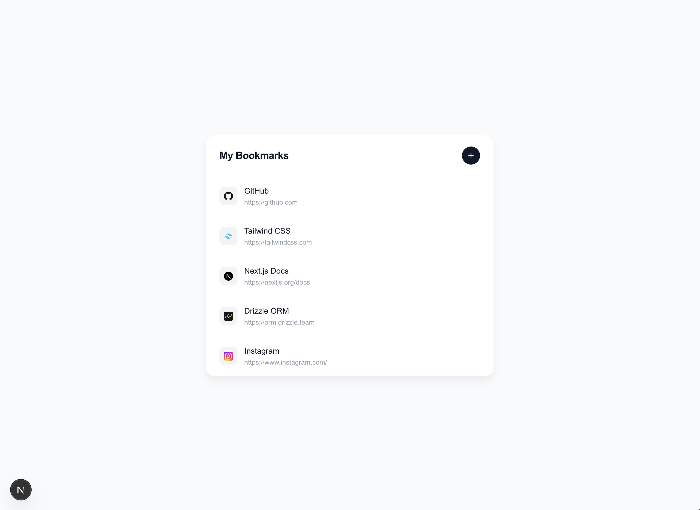

# Bookmark Saver



A minimal, modern bookmark manager built with Next.js, Tailwind CSS, Drizzle ORM, and Supabase.

Save and delete your favorite URLs in a clean, centered UI — no clutter, no filters, just your bookmarks.

---

## Tech Stack

- **Next.js 16** — React framework with App Router and Server Actions
- **Tailwind CSS 4** — Utility-first styling
- **Drizzle ORM** — Type-safe SQL query builder
- **Supabase** — Hosted PostgreSQL database
- **postgres.js** — PostgreSQL driver

---

## Getting Started

### 1. Clone the repo

```bash
git clone <your-repo-url>
cd bookmark-saver
```

### 2. Install dependencies

```bash
npm install
```

### 3. Set up environment variables

Create a `.env` file in the root:

```env
# App runtime — Transaction pooler (port 6543)
DATABASE_URL="postgresql://postgres.<project-ref>:<password>@aws-1-<region>.pooler.supabase.com:6543/postgres"

# Migrations only — Session pooler (port 5432)
DATABASE_MIGRATION_URL="postgresql://postgres.<project-ref>:<password>@aws-1-<region>.pooler.supabase.com:5432/postgres"
```

You can find both connection strings in your Supabase Dashboard under:
**Project Settings → Database → Connection string**

> Use port `6543` (Transaction mode) for `DATABASE_URL` and port `5432` (Session mode) for `DATABASE_MIGRATION_URL`.

### 4. Push the database schema

This creates the `bookmarks` table in your Supabase database:

```bash
npx drizzle-kit push
```

### 5. (Optional) Seed the database

Populate the database with sample bookmarks:

```bash
npm run db:seed
```

### 6. Run the development server

```bash
npm run dev
```

Open [http://localhost:3000](http://localhost:3000) in your browser.

---

## Project Structure

```
├── app/
│   ├── actions.ts          # Server Actions (getBookmarks, addBookmark, deleteBookmark)
│   ├── bookmarks-client.tsx # Interactive UI component
│   ├── page.tsx            # Server component — fetches and passes bookmarks
│   ├── layout.tsx
│   └── globals.css
├── drizzle/
│   ├── schema.ts           # Database schema definition
│   └── seed.ts             # Database seeder
├── lib/
│   └── db.ts               # Drizzle client instance
├── drizzle.config.ts       # Drizzle Kit configuration
└── .env                    # Environment variables (gitignored)
```

---

## Available Scripts

| Script | Description |
|---|---|
| `npm run dev` | Start the development server |
| `npm run build` | Build for production |
| `npm run start` | Start the production server |
| `npm run db:seed` | Seed the database with sample bookmarks |
| `npx drizzle-kit push` | Push schema changes to the database |